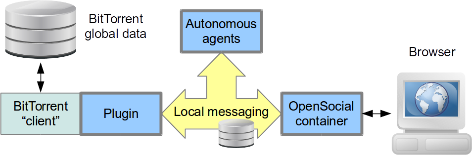
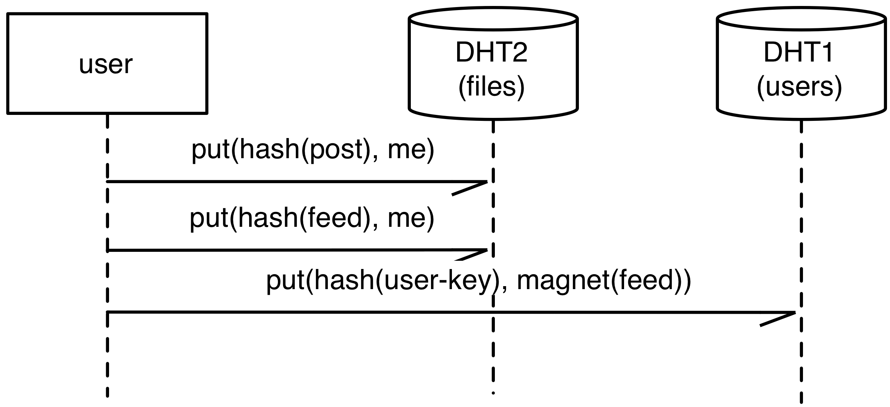
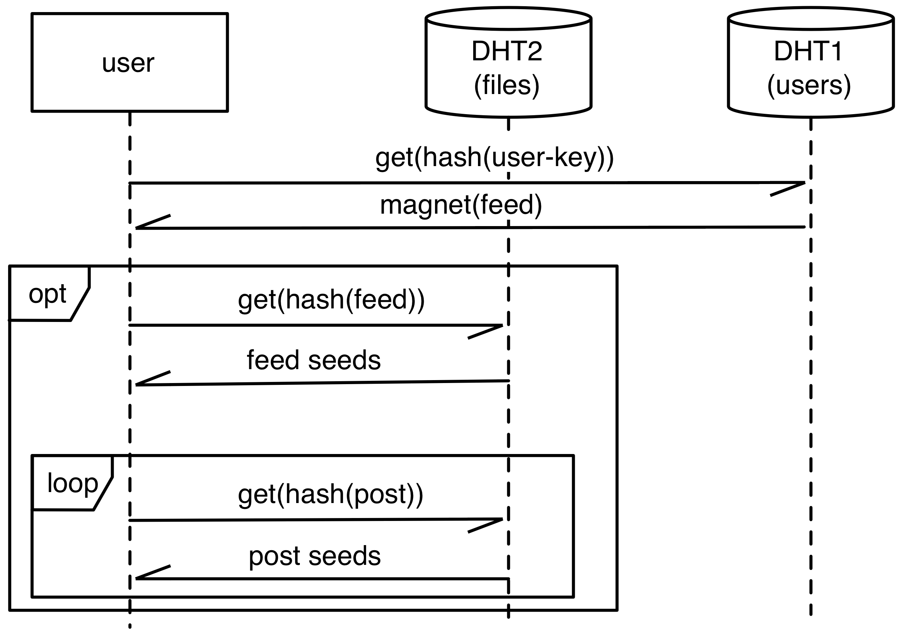
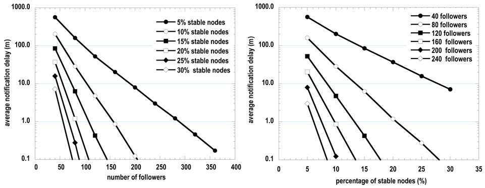
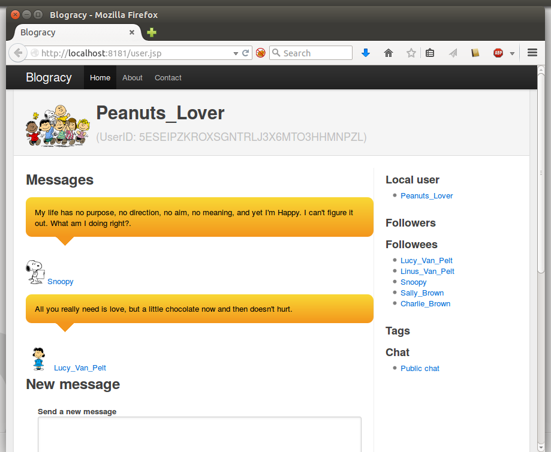
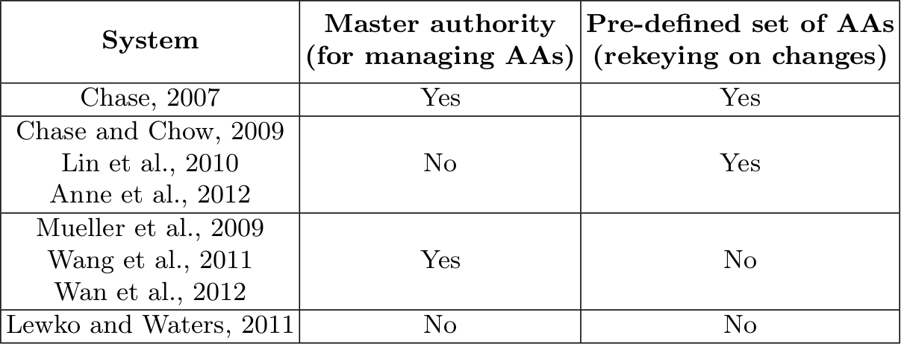
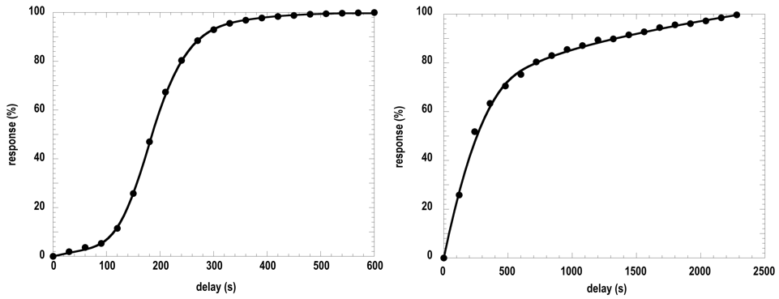

title: Blogracy
subtitle: Preserving Privacy in a P2P Social Network
figure: images/blogracy-logo.png

---

title: Motivations
figure: images/fb-napalm-girl.jpg images/fb-charlie-hebdo.jpg

- Popular social networking platforms
    - Centralized: algorithms (recommendation etc.) have full access to data
    - Web based: easy access, across devices
- But... there are some _“buts”_
    - Risk of mass surveillance
    - Lack of control and risk of censorship
    - Risk of privacy leak
    - Availability and reachability during crisis
    - High cost of ownership, for multimedia services
    - Ads or revenue generating data usage

---

title: Distributed platforms

- Federated systems
    - Diaspora, StatusNet
    - Users can suffer attacks to popular pods
- Custom peer-to-peer systems
    - Freenet, PeerSoN, LotusNet, Safebook, Persona, Life Social
    - In some cases, a single node can still host various users
- Lack of...
    - Systems based on popular P2P protocols
    - Open source, workable implementations

---

title: Design of Blogracy
class: large-image

- Modular design, orthogonal solutions for different aspects
    - Data formats, file sharing protocols
    - Identity, integrity, confidentiality, anonymity
    - Open source, available on GitHub for experimentation
    

    
---

title: Basic formats and protocols

- OpenSocial
    - W3C standard for social activities, based on JSON
    - Recent *social activities* saved in a local file
    - The file *can* include *profile* information
    - ... and a list of *followees*
- BitTorrent
    - File sharing
    - P2P, fully distributed
- Kademlia, Distributed Hash Table
    - All nodes mantain information about file availability
    - Without servers/trackers 

---

title: Identity and security

- Key based identity
    - Each user is identified by his/her public key
- Each user has an associated file
    - Social db: profile, followees and activities
    - DHT for mapping: `user_id` → `file_hash`
- Signed activities for integrity
    - JSON Web signature
- End to end encryption for confidentiality
    - Attribute-Based Encryption

---

title: Resource sharing

---

title: Updating the followees’ feeds

---

title: Node churn

- In P2P, some users connect and others disconnect, continuously
- But in BitTorrent, downloading a resource corresponds to sharing it
- If a user has enough followers, they contribute to make his/her messages available
- Also when the original message source is offline

---

title: Simulation

- Simulations limited to the network of nodes directly following a certain source
    - Usually, this is the sharing community
- Two kinds of nodes
    - Nodes connecting quite occasionally (three times a day, 15 minutes in total)
    - More stable nodes, connecting for 8 hours a day (avg BitTorrent session; collaborative work)
- A follower is online at the instant when a new message is published?
    - Yes: optimal reception time == instant of publication
    - Otherwise: the first time the follower goes online again

---

title: Results of simulations
class: large-image

- Ok with 120 followers, 10% stable nodes → 5 min delay
- Difficult with 40 followers
    - 30% stable node → 10 min delay
    - 5% stable nodes → 8 hours delay

---

title: Long tail of delays
figure: images/figure06.png
figcaption: Cumulative distribution of notification delays
class: large-figure

- Most messages are received virtually immediately
- But for few messages, no seeds are available
- In these cases, quite long delays are suffered

---

title: Implementation, results
class: segue dark

---

title: Implementation over BitTorrent

- Plugin for Vuze (fka Azureus)
    - Java-based BitTorrent client
    - Object-oriented, extensible
- Web application
    - Embedded Jetty web server
- Communications through JMS
    - ActiveMQ
    - Messages exchanged also with the browser
    - Real time updates
- Publish/subscribe channels based on Vuze DHT

---

title: Web based interface

---

title: Push vs. pull propagation

- Polling: unnecessary delays and traffic
    - Pushing: not always appropriate; node churn in P2P
    - Need to strike a balance between polling/pushing mechanisms
- Blogracy: pushing mechanism based on DHT
    - Publish/subscribe on multiple channels
    - Potentially, a channel for each user
    - Users interested in a channel, share a torrent
    - The shared hash is obtained by the name of the channel
    - Messages are sent *directly* to all online subscribers

---

title: Pushing update notifications
figure:  images/figure09.png
figcaption: Cumulative distribution of the delay (millis) of direct notification messages
class: large-figure

- Testing: 20 nodes over the PlanetLab testbed, constantly online
- All nodes participate to a common publish/subscribe channel
- 90% of messages are received in (less than) half a minute

---

title: Polling full files, at startup
figure:  images/figure10.png
figcaption: Cumulative distribution of the delay in the reception of messages
class: large-figure

- Testing: 20 nodes over the PlanetLab testbed, constantly online
- 90% of messages are received in (less than) 3.5 minutes
    - A polling cycle every two minutes...
    - accounts for 1 additional minute, on average

---

title: Attribute-Based Encryption
figure: images/targeted-broadcast.png
class: large-figure

- Cyphertext-Policy Attribute-Based Encryption *(Bethencourt, Sahai and Waters, 2007)*
    - Certified attributes grant access rights to users
    - Attribute authority, a *trusted third party*
- Blogracy: *targeted broadcast*
    - Attributes issued directly by content creators to acknowledged followers
    - Access policy for each message (or social activity)
    - Each message disclosed to different intended receivers
    - Attribute credentials in their content creator's feed, encrypted with the follower's public key

---

title: Multi-authority protocols
class: large-image

>

Features of various Multi-Authority ABE schemes

No concrete scheme available for usage in P2P scenarios 

---

title: Re-certification

- “Best News” certifies that Alice is among its own reporters (*attribute certificate*)
- Alice shows the certificate to Carol
- Carol trusts “Best News” for that kind of attributes
- Carol issues her own certification to Alice, as a “Best News reporter”
- Alice can then access Carol's messages targeted to “Best News reporter”

---

title: Network-level anonymity

- ISP can easily deanonymize users
    - Proxies and mix networks for network-level anonymity
- Tor for network anonymity
    - Focused on web browsing through outproxies
    - Supports internal hidden services...
    - But discourages public file sharing
    - Darknet-based file sharing is virtually nonexistant
- I2P
    - Experimental, small community
    - Not focused on browsing the web
    - Supports internal hidden services...
    - And encourages file-sharing among darknet peers

---

title: Performance over I2P
class: large-image

- Times are much longer (3.5x)
- In line with other measurements, about web browsing with Tor and I2P

---

title: Conclusion

- Anonymity, confidentiality, direct control over posts
- Scalability, especially for multimedia files
- Working prototype, for testing and further development
- Modular architecture: BitTorrent backend, web interface, standard formats
- Orthogonal solutions for different aspects
- Experimental verification, for identifying workable conditions

